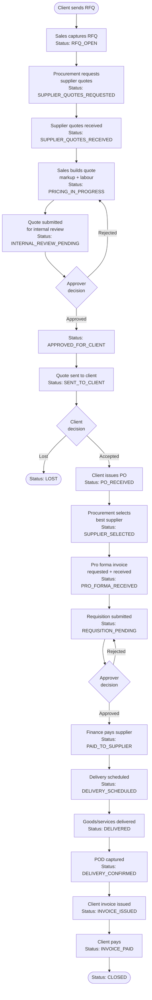

# Project Sunshine — MVP Requirements Pack
**IT Services Business Management System**
*Version 1.0 | 2026-03-27*

---

## CONTEXT

Project Sunshine is a new internal business system for an IT services company. The user wants it scaffolded using the **tlaka-treats architecture** (Fastify + TypeScript + Prisma + PostgreSQL backend; Expo Router + Zustand + React Query mobile/web frontend; maroon `#8B3A3A` brand color, Card/Badge/KpiCard UI components).

This document is the full implementation-ready requirements pack, produced in planning mode before any code is written.

---

# SECTION 1 — EXECUTIVE SUMMARY

## Business Problem
The company operates as an IT services reseller and professional services provider. Currently, the end-to-end process from client RFQ to final invoice is managed manually — likely across email, spreadsheets, and disconnected tools. This creates risk at every handoff: quotes are lost, supplier pricing is not compared systematically, markups are applied inconsistently, approvals happen informally, delivery is not tracked, and invoices lag behind delivery.

## Purpose of the System
Project Sunshine provides a single, structured system that tracks every deal from the moment a client sends an RFQ to the moment the final invoice is issued and paid. It enforces process gates (no quote sent without approval, no procurement without a PO, no invoice without delivery confirmation), creates an audit trail, and gives management real-time visibility into the pipeline.

## MVP Scope
The MVP covers the full end-to-end deal lifecycle for a single-company internal system:

- RFQ capture → supplier quote collection → quote building (markup + labour) → internal approval → client quote submission
- PO receipt → supplier selection → pro forma invoice → requisition/finance approval → supplier payment
- Delivery scheduling → delivery confirmation → proof of delivery → client invoicing

Out of scope for MVP: external accounting system integration, automated email sending, mobile app (web-first), multi-company/branch support.

---

# SECTION 2 — END-TO-END BUSINESS PROCESS

| Step | Actor | Action | System Gate |
|------|-------|--------|-------------|
| 1 | Client | Issues RFQ (email/verbal) | Sales captures RFQ in system |
| 2 | Sales | Requests quotes from suppliers | Supplier quote requests logged |
| 3 | Supplier | Returns pricing | Procurement captures supplier quote lines |
| 4 | Sales/Procurement | Adds hardware markup per line | Markup applied to cost price |
| 5 | Sales | Adds labour lines (fixed or T&M) | Labour lines attached to quote |
| 6 | Approver | Reviews and approves client quote | Status must be "Approved" to send |
| 7 | Sales | Sends quote to client | Quote PDF generated; status = Sent |
| 8 | Client | Evaluates quote | No system action needed |
| 9 | Client | Issues PO (if accepted) | Sales captures PO reference and amount |
| 10 | Procurement | Re-reviews supplier quotes, selects best | Supplier award recorded |
| 11 | Procurement | Requests pro forma from selected supplier | Pro forma request logged |
| 12 | Procurement | Prepares internal requisition | Requisition submitted for approval |
| 13 | Approver/Finance | Approves requisition | Finance notified to pay |
| 14 | Finance | Processes supplier payment | Payment recorded, receipt attached |
| 15 | Delivery Manager | Confirms delivery method and schedules | Delivery record created |
| 16 | Delivery Manager | Delivers goods/services to client | Delivery status updated |
| 17 | Delivery Manager | Captures delivery note / POD | POD document attached |
| 18 | Sales/Finance | Issues client invoice | Invoice references PO + delivery confirmation |

---

# SECTION 3 — BUSINESS RULES

## Core Business Rules

| # | Rule | Notes |
|---|------|-------|
| BR-01 | A quote cannot be sent to a client unless it has been approved by an Approver | Enforced by status gate |
| BR-02 | A PO must be received and captured before procurement activities can start | System blocks requisition creation without PO |
| BR-03 | Hardware/item lines must have a cost price and a markup % | Markup can be a default or overridden per line |
| BR-04 | Labour can be Fixed Fee or Time & Material; both types can coexist on the same quote | No restriction on mixing |
| BR-05 | Time & Material labour must have a unit rate and estimated hours; billed hours captured on delivery | Estimated vs actual tracked separately |
| BR-06 | A supplier must be formally awarded/selected before a pro forma invoice can be requested | System enforces this gate |
| BR-07 | Supplier pricing must be captured from at least one supplier before a client quote can be built | Warn if zero supplier quotes exist |
| BR-08 | Finance payment status must be tracked with date, amount, and reference | Partial payments are recorded individually |
| BR-09 | Delivery cannot be marked as confirmed without a delivery note or POD attachment | System enforces file upload requirement |
| BR-10 | Client invoice must reference the accepted quote, the PO number, and the delivery confirmation | System auto-populates these references |
| BR-11 | Quote versions are immutable once approved; a new version must be created for any changes | Version history preserved |
| BR-12 | A default markup % can be set at company level and overridden at quote or line level | Hierarchy: Line > Quote > Company default |
| BR-13 | Multiple supplier quotes can be captured per RFQ; the best is selected during procurement | No limit on supplier count |
| BR-14 | An RFQ can contain multiple line items of different types (hardware, software, labour, other) | Mixed quotes are fully supported |
| BR-15 | Client invoice amount must not exceed the accepted quote amount without explicit override + approval | Prevents billing errors |

## Inferred Best-Practice Rules *(Assumption label: A)*

| # | Rule | Rationale |
|---|------|-----------|
| A-BR-01 | Quotes expire after 30 days unless manually extended | Standard commercial practice |
| A-BR-02 | A quote can only be re-sent after a new version or explicit override | Prevents client confusion with multiple quote versions |
| A-BR-03 | Supplier payment cannot exceed the pro forma invoice amount without a second approval | Spend control |
| A-BR-04 | Partial deliveries are allowed; each partial delivery generates its own POD | Common in hardware supply |
| A-BR-05 | A client invoice can only be issued once delivery is confirmed (or services accepted) | Prevents premature billing |
| A-BR-06 | Approval thresholds apply: quotes above a configurable value (e.g. R50,000) require senior approval | Spend governance |
| A-BR-07 | All monetary values are stored in a base currency (ZAR assumed); multi-currency is future scope | MVP simplification |

---

# SECTION 4 — FUNCTIONAL REQUIREMENTS

## Module 4.1 — Client Management

**Purpose:** Maintain a master record of clients and their contacts.

| Item | Detail |
|------|--------|
| Purpose | Central client directory linked to all RFQs, quotes, POs, and invoices |
| Key Features | Create/edit client profiles; manage multiple contacts per client; client status (active/inactive); notes |
| Inputs | Client name, registration number, VAT number, address, industry, account manager, credit terms |
| Outputs | Client profile page; client history (all RFQs, quotes, invoices); client contact list |

---

## Module 4.2 — RFQ Capture

**Purpose:** Record every incoming client request as a structured RFQ.

| Item | Detail |
|------|--------|
| Purpose | Formal entry point for every deal; ensures nothing is handled informally |
| Key Features | Create RFQ with line items; assign account manager; set deadline; attach client's original RFQ document; link to client |
| Inputs | Client, date received, deadline, description, line items (description, qty, unit, category), attachments |
| Outputs | RFQ record with unique reference number; RFQ list view; RFQ PDF for internal use |

**RFQ Line Item Types:** Hardware, Software, Licence, Labour (Fixed), Labour (T&M), Other

---

## Module 4.3 — Supplier Quote Capture

**Purpose:** Record pricing received from one or more suppliers against an RFQ.

| Item | Detail |
|------|--------|
| Purpose | Centralise all supplier responses so they can be compared side by side |
| Key Features | Log supplier quote per RFQ; capture line-level pricing; record lead time, validity, payment terms; attach supplier quote document; support multiple suppliers |
| Inputs | Supplier, quote date, validity period, payment terms, lead time, currency, line items (description, qty, unit cost), attachments |
| Outputs | Supplier quote record; comparison view across suppliers for same RFQ |

---

## Module 4.4 — Quote Builder

**Purpose:** Build the client-facing quote from supplier cost + markup + labour.

| Item | Detail |
|------|--------|
| Purpose | Produce an accurate, margin-aware client quote from underlying cost inputs |
| Key Features | Import supplier quote lines; apply markup per line; add labour lines; auto-calculate sell price, cost, and margin; support multiple versions; attach notes per line |
| Inputs | Supplier quote lines (cost), markup %, labour lines (type, rate, hours/fee), quote validity, terms |
| Outputs | Client quote document; quote summary (total cost, total sell, gross margin); version history |

**Pricing Formula:**
- Hardware sell price = Cost × (1 + Markup%)
- Labour Fixed = fixed fee (no cost basis required unless internal rate is tracked)
- Labour T&M = Unit rate × Estimated hours
- Total Quote = Σ(sell prices) + Σ(labour lines)
- Gross Margin = Total Quote − Total Cost

---

## Module 4.5 — Markup Management

**Purpose:** Control default and override markup percentages.

| Item | Detail |
|------|--------|
| Purpose | Ensure consistent but flexible margin application |
| Key Features | Set company-level default markup %; override per quote; override per line item; markup audit trail |
| Inputs | Default markup %, per-quote override, per-line override |
| Outputs | Effective markup displayed per line; margin summary |

---

## Module 4.6 — Labour Pricing Management

**Purpose:** Structure and cost all labour included in a quote.

| Item | Detail |
|------|--------|
| Purpose | Accurately price fixed and variable labour components |
| Key Features | Add multiple labour lines per quote; select type (Fixed/T&M); set description, rate, hours, or fixed fee; track estimated vs actual on T&M |
| Inputs | Labour description, type (Fixed/T&M), rate (T&M), estimated hours (T&M), fixed fee (Fixed) |
| Outputs | Labour line cost in quote; total labour on quote; actual hours captured on delivery |

---

## Module 4.7 — Internal Review and Approval

**Purpose:** Enforce an internal review gate before any quote is sent to a client.

| Item | Detail |
|------|--------|
| Purpose | Quality control and margin protection |
| Key Features | Submit quote for review; approver sees quote summary with margin; approve or reject with comments; threshold-based routing (e.g. >R50k requires senior approval) |
| Inputs | Quote submitted by sales; approver's decision + comments |
| Outputs | Approved/rejected status; approval audit log; rejection reason captured |

---

## Module 4.8 — Client Quote Submission

**Purpose:** Formally send the approved quote to the client.

| Item | Detail |
|------|--------|
| Purpose | Track when and what version was sent to the client |
| Key Features | Generate quote PDF; record sent date; log client contact sent to; support manual send (email outside system, for MVP) |
| Inputs | Approved quote; send date; recipient contact |
| Outputs | Quote PDF; status updated to "Sent to Client"; record of sent date |

---

## Module 4.9 — PO Capture

**Purpose:** Record the client's Purchase Order when they accept the quote.

| Item | Detail |
|------|--------|
| Purpose | Formal trigger for procurement to begin |
| Key Features | Capture PO number, date, PO value, client contact; attach PO document; link to accepted quote |
| Inputs | PO number, PO date, PO amount, client, attachment |
| Outputs | PO record; status updated to "PO Received"; procurement unlocked |

---

## Module 4.10 — Supplier Selection

**Purpose:** Formally award a supplier after re-reviewing all supplier quotes.

| Item | Detail |
|------|--------|
| Purpose | Documented supplier selection decision with rationale |
| Key Features | Compare supplier quotes side by side; select winning supplier; record rationale; date of award |
| Inputs | Supplier comparison view; selected supplier; rationale |
| Outputs | Supplier Award record; pro forma request unlocked |

---

## Module 4.11 — Pro Forma Invoice Tracking

**Purpose:** Track the request and receipt of the supplier's pro forma invoice.

| Item | Detail |
|------|--------|
| Purpose | Gate for finance payment — payment only after pro forma received |
| Key Features | Log pro forma request date; record expected amount; attach received pro forma; track overdue requests |
| Inputs | Request date, expected amount, supplier; attachment on receipt |
| Outputs | Pro forma record; finance approval unlocked on receipt |

---

## Module 4.12 — Requisition and Approval Workflow

**Purpose:** Internal purchase requisition and multi-level approval before finance pays.

| Item | Detail |
|------|--------|
| Purpose | Spend governance and audit compliance |
| Key Features | Create requisition from pro forma; submit for approval; threshold-based routing; approve/reject with comments; escalation path |
| Inputs | Requisition details (supplier, amount, description), pro forma reference, approver assignment |
| Outputs | Approved/rejected requisition; finance payment unlocked on approval |

---

## Module 4.13 — Finance Payment Tracking

**Purpose:** Record and track supplier payments.

| Item | Detail |
|------|--------|
| Purpose | Visibility of what has been paid, to whom, and when |
| Key Features | Log payment details (date, amount, method, reference); attach remittance; support partial payments; track balance |
| Inputs | Payment date, amount, method (EFT/credit card), reference, attachment |
| Outputs | Payment record; supplier payment status (Pending/Partial/Paid); total paid vs pro forma |

---

## Module 4.14 — Delivery Management

**Purpose:** Schedule and track delivery of goods and/or services to the client.

| Item | Detail |
|------|--------|
| Purpose | Ensure the client receives what was promised, and it is tracked |
| Key Features | Create delivery record; assign delivery method (courier/own delivery/remote); set expected delivery date; assign responsible person; support partial deliveries |
| Inputs | Delivery method, expected date, responsible person, line items to deliver |
| Outputs | Delivery record; delivery schedule; status (Scheduled / In Transit / Delivered) |

---

## Module 4.15 — Delivery Confirmation / Proof of Delivery

**Purpose:** Formally close delivery with verified confirmation.

| Item | Detail |
|------|--------|
| Purpose | Gate for client invoicing; audit evidence of delivery |
| Key Features | Mark delivery as confirmed; upload POD document or delivery note; capture confirmation date; capture who confirmed; support partial delivery confirmation |
| Inputs | Confirmation date, confirmed by (name/contact), POD attachment |
| Outputs | Confirmed delivery record; client invoicing unlocked; POD stored |

---

## Module 4.16 — Client Invoicing

**Purpose:** Generate and track the client invoice after delivery is confirmed.

| Item | Detail |
|------|--------|
| Purpose | Revenue capture and receivables tracking |
| Key Features | Generate invoice from accepted quote + PO; auto-populate line items; set invoice date and due date; capture payment received; track outstanding; attach invoice PDF |
| Inputs | Quote reference, PO number, delivery confirmation, invoice date, due date, payment terms |
| Outputs | Client invoice record + PDF; status (Draft/Issued/Paid/Overdue); accounts receivable summary |

---

## Module 4.17 — Reporting and Dashboards

**Purpose:** Give management real-time visibility of the pipeline and financials.

| Item | Detail |
|------|--------|
| Purpose | Decision-making and performance management |
| Key Features | Pipeline overview; RFQ status summary; margin reports; win/loss tracking; delivery status; payment status; KPI cards |
| Inputs | All deal data from the system |
| Outputs | Dashboard with KPI cards; filterable reports; exportable data |

---

# SECTION 5 — USER ROLES

| Role | Description | Can Create | Can Approve | Can View |
|------|-------------|-----------|-------------|---------|
| **Sales / Account Manager** | Manages client relationship, creates RFQs, builds quotes | RFQ, Client Quote, Quote versions, PO capture | — | Own deals + client data |
| **Procurement Officer** | Manages supplier engagement, captures supplier quotes, selects supplier, tracks pro forma | Supplier quotes, Supplier award, Pro forma request, Delivery record | — | Supplier and procurement data |
| **Finance User** | Tracks supplier payments, manages client invoices | Client invoice, Payment record | — | Financial records, all invoices |
| **Delivery Manager** | Manages physical/remote delivery, captures POD | Delivery record, POD | Delivery confirmation | Delivery data |
| **Approver / Manager** | Reviews and approves quotes and requisitions | — | Internal quote approval, Requisition approval | All data in their scope |
| **Senior Approver** | High-value deal approval (above threshold) | — | High-value quote approval, High-value requisition | All data |
| **Admin** | System configuration, user management | Users, markup defaults, company settings, lookup tables | — | Everything |

---

# SECTION 6 — WORKFLOW STATUSES

## RFQ / Deal Lifecycle Statuses

| Status | Meaning | Who Sets It |
|--------|---------|-------------|
| `RFQ_DRAFT` | RFQ captured but incomplete | Sales |
| `RFQ_OPEN` | RFQ submitted; supplier quotes being requested | Sales |
| `SUPPLIER_QUOTES_REQUESTED` | Formal supplier quote requests sent | Procurement |
| `SUPPLIER_QUOTES_RECEIVED` | At least one supplier quote captured | Procurement |
| `PRICING_IN_PROGRESS` | Quote builder open; markup and labour being added | Sales |
| `INTERNAL_REVIEW_PENDING` | Quote submitted for internal approval | Approver |
| `APPROVED_FOR_CLIENT` | Quote approved; ready to send | Approver |
| `SENT_TO_CLIENT` | Quote delivered to client | Sales |
| `CLIENT_EVALUATING` | Awaiting client decision (optional intermediate) | System/Sales |
| `CLIENT_ACCEPTED` | Client verbally accepted | Sales |
| `PO_RECEIVED` | Client's PO captured in system | Sales |
| `SUPPLIER_SELECTION_PENDING` | Procurement reviewing supplier prices | Procurement |
| `SUPPLIER_SELECTED` | Winning supplier awarded | Procurement |
| `PRO_FORMA_REQUESTED` | Pro forma invoice requested from supplier | Procurement |
| `PRO_FORMA_RECEIVED` | Supplier pro forma captured | Procurement |
| `REQUISITION_PENDING` | Requisition submitted; awaiting approval | Approver |
| `REQUISITION_APPROVED` | Requisition approved; finance can pay | Finance |
| `PAYMENT_PENDING` | Finance to process supplier payment | Finance |
| `PAID_TO_SUPPLIER` | Payment made and recorded | Finance |
| `DELIVERY_SCHEDULED` | Delivery date and method confirmed | Delivery Manager |
| `IN_TRANSIT` | Goods en route | Delivery Manager |
| `DELIVERED` | Goods/services delivered; awaiting POD | Delivery Manager |
| `DELIVERY_CONFIRMED` | POD uploaded and confirmed | Delivery Manager |
| `INVOICE_DRAFT` | Client invoice being prepared | Finance/Sales |
| `INVOICE_ISSUED` | Invoice sent to client | Finance |
| `INVOICE_PAID` | Client payment received | Finance |
| `CLOSED` | Deal fully complete and reconciled | Admin/Finance |
| `LOST` | Client did not accept quote | Sales |
| `CANCELLED` | Deal cancelled at any stage | Admin |

---

# SECTION 7 — DATA MODEL / ENTITIES

## 7.1 Client
**Represents:** A company or individual who sends RFQs and receives quotes/invoices.

| Field | Type | Notes |
|-------|------|-------|
| id | UUID | PK |
| name | String | Company name |
| registrationNumber | String | Optional |
| vatNumber | String | Optional |
| billingAddress | JSON | Street, city, province, postal, country |
| deliveryAddress | JSON | May differ from billing |
| creditTerms | Int | Days (e.g. 30) |
| accountManagerId | FK → User | |
| status | Enum | ACTIVE / INACTIVE |
| notes | Text | |
| createdAt | DateTime | |

**Relationships:** has many Contacts, RFQs, ClientQuotes, ClientInvoices

---

## 7.2 Contact
**Represents:** An individual at the client company.

| Field | Type | Notes |
|-------|------|-------|
| id | UUID | PK |
| clientId | FK → Client | |
| firstName | String | |
| lastName | String | |
| email | String | |
| phone | String | |
| role | String | Job title |
| isPrimary | Boolean | |

---

## 7.3 Supplier
**Represents:** A vendor the company sources products or services from.

| Field | Type | Notes |
|-------|------|-------|
| id | UUID | PK |
| name | String | |
| registrationNumber | String | |
| vatNumber | String | |
| paymentTerms | String | |
| preferredContact | String | |
| status | Enum | ACTIVE / INACTIVE |
| notes | Text | |

**Relationships:** has many SupplierQuotes, SupplierAwards, ProFormaInvoices, SupplierPayments

---

## 7.4 RFQ (Request for Quote)
**Represents:** A client's request for pricing on hardware, software, and/or services.

| Field | Type | Notes |
|-------|------|-------|
| id | UUID | PK |
| referenceNumber | String | Auto-generated (e.g. RFQ-2026-0001) |
| clientId | FK → Client | |
| contactId | FK → Contact | Who sent the RFQ |
| accountManagerId | FK → User | |
| receivedDate | DateTime | |
| deadline | DateTime | Client's required response date |
| description | Text | General scope |
| status | Enum | RFQ statuses above |
| attachments | Relation | Client's original RFQ docs |
| createdAt | DateTime | |

**Relationships:** has many RFQLineItems, SupplierQuotes, ClientQuotes

---

## 7.5 RFQ Line Item
**Represents:** A single item/service requested by the client in an RFQ.

| Field | Type | Notes |
|-------|------|-------|
| id | UUID | PK |
| rfqId | FK → RFQ | |
| lineNumber | Int | Display order |
| description | String | |
| category | Enum | HARDWARE / SOFTWARE / LICENCE / LABOUR_FIXED / LABOUR_TM / OTHER |
| quantity | Decimal | |
| unit | String | Each, licence, hour |
| notes | Text | |

---

## 7.6 SupplierQuote
**Represents:** A pricing response from a single supplier for an RFQ.

| Field | Type | Notes |
|-------|------|-------|
| id | UUID | PK |
| rfqId | FK → RFQ | |
| supplierId | FK → Supplier | |
| quoteDate | DateTime | |
| validUntil | DateTime | |
| paymentTerms | String | |
| leadTimeDays | Int | |
| currency | String | Default ZAR |
| totalCost | Decimal | Calculated |
| status | Enum | REQUESTED / RECEIVED / EXPIRED |
| notes | Text | |

**Relationships:** has many SupplierQuoteLines, referenced by SupplierAward

---

## 7.7 SupplierQuoteLine
**Represents:** A single line on a supplier's quote.

| Field | Type | Notes |
|-------|------|-------|
| id | UUID | PK |
| supplierQuoteId | FK → SupplierQuote | |
| rfqLineItemId | FK → RFQLineItem | Optional link |
| description | String | |
| quantity | Decimal | |
| unitCost | Decimal | |
| totalCost | Decimal | Calculated |
| notes | Text | |

---

## 7.8 ClientQuote (Quote Version)
**Represents:** A versioned quote prepared for the client. Immutable once approved.

| Field | Type | Notes |
|-------|------|-------|
| id | UUID | PK |
| rfqId | FK → RFQ | |
| versionNumber | Int | 1, 2, 3… |
| status | Enum | DRAFT / SUBMITTED_FOR_REVIEW / APPROVED / REJECTED / SENT / ACCEPTED / LOST |
| defaultMarkupPct | Decimal | Company default at time of quote |
| validUntil | DateTime | |
| terms | Text | |
| totalCost | Decimal | Calculated |
| totalSell | Decimal | Calculated |
| grossMargin | Decimal | Calculated |
| grossMarginPct | Decimal | Calculated |
| preparedById | FK → User | |
| approvedById | FK → User | |
| approvedAt | DateTime | |
| sentAt | DateTime | |
| notes | Text | |

**Relationships:** has many QuoteLines (hardware + labour), Approvals

---

## 7.9 QuoteLine
**Represents:** A single line on the client quote (hardware/software/labour).

| Field | Type | Notes |
|-------|------|-------|
| id | UUID | PK |
| clientQuoteId | FK → ClientQuote | |
| lineNumber | Int | |
| description | String | |
| category | Enum | HARDWARE / SOFTWARE / LICENCE / LABOUR_FIXED / LABOUR_TM / OTHER |
| quantity | Decimal | |
| unit | String | |
| unitCost | Decimal | From supplier quote |
| markupPct | Decimal | Line-level override |
| unitSell | Decimal | Calculated: unitCost × (1 + markupPct) |
| labourType | Enum | FIXED / TIME_AND_MATERIAL / null |
| labourRate | Decimal | T&M: rate per hour |
| labourHoursEstimated | Decimal | T&M estimated |
| labourFixedFee | Decimal | Fixed fee amount |
| totalCost | Decimal | Calculated |
| totalSell | Decimal | Calculated |
| notes | Text | |
| supplierQuoteLineId | FK → SupplierQuoteLine | Optional reference |

---

## 7.10 MarkupRule
**Represents:** Company-level default markup configuration.

| Field | Type | Notes |
|-------|------|-------|
| id | UUID | PK |
| category | Enum | HARDWARE / SOFTWARE / LICENCE / OTHER / ALL |
| defaultMarkupPct | Decimal | |
| effectiveFrom | DateTime | |
| createdById | FK → User | |

---

## 7.11 PurchaseOrder (Client PO)
**Represents:** The client's Purchase Order received after quote acceptance.

| Field | Type | Notes |
|-------|------|-------|
| id | UUID | PK |
| clientQuoteId | FK → ClientQuote | |
| rfqId | FK → RFQ | |
| clientId | FK → Client | |
| poNumber | String | Client's PO number |
| poDate | DateTime | |
| poAmount | Decimal | Must match or exceed accepted quote |
| receivedById | FK → User | |
| receivedAt | DateTime | |

**Relationships:** referenced by ClientInvoice, triggers procurement start

---

## 7.12 SupplierAward
**Represents:** The formal selection of a winning supplier.

| Field | Type | Notes |
|-------|------|-------|
| id | UUID | PK |
| rfqId | FK → RFQ | |
| supplierQuoteId | FK → SupplierQuote | Winning quote |
| supplierId | FK → Supplier | |
| awardedById | FK → User | |
| awardedAt | DateTime | |
| rationale | Text | Why this supplier was selected |

---

## 7.13 ProFormaInvoice
**Represents:** The supplier's pro forma invoice received before payment.

| Field | Type | Notes |
|-------|------|-------|
| id | UUID | PK |
| rfqId | FK → RFQ | |
| supplierId | FK → Supplier | |
| supplierAwardId | FK → SupplierAward | |
| requestedAt | DateTime | When company asked for pro forma |
| receivedAt | DateTime | When pro forma arrived |
| amount | Decimal | |
| currency | String | |
| status | Enum | REQUESTED / RECEIVED / OVERDUE |

**Relationships:** referenced by Requisition

---

## 7.14 Requisition
**Represents:** Internal purchase requisition submitted to authorise supplier payment.

| Field | Type | Notes |
|-------|------|-------|
| id | UUID | PK |
| rfqId | FK → RFQ | |
| proFormaInvoiceId | FK → ProFormaInvoice | |
| supplierId | FK → Supplier | |
| requestedById | FK → User | |
| requestedAt | DateTime | |
| amount | Decimal | |
| description | Text | |
| status | Enum | DRAFT / PENDING / APPROVED / REJECTED |

**Relationships:** has many Approvals, triggers SupplierPayment

---

## 7.15 Approval
**Represents:** An approval decision on a quote or requisition.

| Field | Type | Notes |
|-------|------|-------|
| id | UUID | PK |
| entityType | Enum | CLIENT_QUOTE / REQUISITION |
| entityId | UUID | FK to relevant entity |
| approverId | FK → User | |
| decision | Enum | APPROVED / REJECTED / PENDING |
| comments | Text | |
| decidedAt | DateTime | |
| level | Int | For multi-level: 1 = first approver |

---

## 7.16 SupplierPayment
**Represents:** A payment made to a supplier.

| Field | Type | Notes |
|-------|------|-------|
| id | UUID | PK |
| requisitionId | FK → Requisition | |
| supplierId | FK → Supplier | |
| amount | Decimal | |
| paymentDate | DateTime | |
| paymentMethod | Enum | EFT / CREDIT_CARD / CASH / OTHER |
| reference | String | Bank reference |
| status | Enum | PENDING / PAID | |
| notes | Text | |

---

## 7.17 Delivery
**Represents:** A scheduled delivery of goods or services to the client.

| Field | Type | Notes |
|-------|------|-------|
| id | UUID | PK |
| rfqId | FK → RFQ | |
| method | Enum | COURIER / OWN_DELIVERY / REMOTE / COLLECTION |
| scheduledDate | DateTime | |
| actualDate | DateTime | |
| responsibleUserId | FK → User | |
| status | Enum | SCHEDULED / IN_TRANSIT / DELIVERED / CONFIRMED / PARTIAL |
| notes | Text | |
| isPartial | Boolean | |

**Relationships:** has many DeliveryLines, DeliveryNotes

---

## 7.18 DeliveryLine
**Represents:** A specific item/service being delivered in this delivery.

| Field | Type | Notes |
|-------|------|-------|
| id | UUID | PK |
| deliveryId | FK → Delivery | |
| quoteLineId | FK → QuoteLine | |
| description | String | |
| quantityDelivered | Decimal | |

---

## 7.19 DeliveryNote (POD)
**Represents:** Proof of delivery or delivery note captured after delivery.

| Field | Type | Notes |
|-------|------|-------|
| id | UUID | PK |
| deliveryId | FK → Delivery | |
| confirmedAt | DateTime | |
| confirmedByName | String | Name of client signatory |
| confirmedByContact | String | Email or phone |
| notes | Text | |

**Relationships:** has Attachments (POD document)

---

## 7.20 ClientInvoice
**Represents:** Invoice issued to the client after delivery confirmation.

| Field | Type | Notes |
|-------|------|-------|
| id | UUID | PK |
| rfqId | FK → RFQ | |
| clientId | FK → Client | |
| clientQuoteId | FK → ClientQuote | |
| purchaseOrderId | FK → PurchaseOrder | |
| deliveryNoteId | FK → DeliveryNote | |
| invoiceNumber | String | Auto-generated |
| invoiceDate | DateTime | |
| dueDate | DateTime | |
| totalAmount | Decimal | |
| status | Enum | DRAFT / ISSUED / PAID / OVERDUE / CANCELLED |
| paidAt | DateTime | |
| paidAmount | Decimal | |
| notes | Text | |

---

## 7.21 Attachment
**Represents:** A file attached to any entity in the system.

| Field | Type | Notes |
|-------|------|-------|
| id | UUID | PK |
| entityType | Enum | RFQ / SUPPLIER_QUOTE / CLIENT_QUOTE / PO / PRO_FORMA / DELIVERY_NOTE / INVOICE / REQUISITION |
| entityId | UUID | FK to relevant entity |
| fileName | String | |
| fileSize | Int | Bytes |
| mimeType | String | |
| storageUrl | String | Cloud storage path |
| uploadedById | FK → User | |
| uploadedAt | DateTime | |

---

# SECTION 8 — SCREENS / PAGES

## Dashboard
- KPI cards: Open RFQs, Quotes Pending Approval, POs Received, Deliveries Due Today, Invoices Outstanding
- Pipeline funnel view (RFQ → Quote → PO → Delivery → Invoice)
- Alerts: Overdue supplier quotes, missing PODs, pending approvals

## RFQ List
- Filterable by status, account manager, client, date range
- Status badges per row
- Quick actions: Open, Create Quote, Log Supplier Quote

## RFQ Detail
- Full RFQ info: client, deadline, description, line items
- Supplier quotes panel (all received quotes)
- Client quotes panel (all versions)
- Timeline/activity log
- Attachments section

## Supplier Quote Comparison
- Side-by-side table: Supplier A vs Supplier B vs Supplier C
- Per-line cost comparison
- Total cost per supplier
- Lead time and payment terms comparison
- "Award Supplier" button

## Quote Builder
- Header: client, quote ref, version, validity, default markup
- Line items table: description, qty, cost, markup %, sell price, margin
- Labour section: add Fixed or T&M lines
- Summary panel: total cost, total sell, gross margin %
- Submit for approval button

## Internal Approval Screen
- Queue of quotes/requisitions pending the logged-in approver's decision
- Summary: deal value, margin %, account manager, client
- Full quote detail view
- Approve / Reject with comment

## Client Quote Screen
- Read-only approved quote view formatted for client presentation
- Generate PDF button
- Mark as Sent button (logs date + recipient)
- Capture PO button (appears after "Sent")

## PO Capture Screen
- Form: PO number, PO date, PO amount, client contact, attachment upload
- Links to accepted quote automatically
- Confirms procurement is now unlocked

## Supplier Award / Selection Screen
- Supplier comparison view (re-surfaced from earlier)
- "Select Supplier" with rationale field
- Request Pro Forma button

## Pro Forma and Requisition Screen
- Log pro forma request and receipt
- Create requisition from pro forma
- Submit requisition for approval
- Show approval status

## Finance Payment Screen
- List of approved requisitions awaiting payment
- Log payment: date, amount, method, reference, remittance attachment
- Running total: pro forma amount vs paid

## Delivery Tracking Screen
- List of deliveries with status and date
- Create delivery, assign method, schedule date
- Mark as delivered
- Upload POD / delivery note
- Confirm delivery (unlocks invoice)

## Client Invoicing Screen
- List of confirmed deliveries not yet invoiced
- Create invoice from delivery + PO + quote
- Auto-populated line items
- Set invoice date and due date
- Mark as issued, track payment received

## Reports Screen
- Report selector: Pipeline, Margin, Win-Loss, Supplier Payments, Delivery Cycle, Receivables
- Date range filters
- Tabular + chart view
- Export button (CSV/PDF)

---

# SECTION 9 — APPROVAL WORKFLOW

## 9.1 Internal Quote Approval

```
Sales submits quote for review
        │
        ▼
Deal value check
   ≤ R50,000?          > R50,000?
        │                    │
        ▼                    ▼
  Manager review    Senior Manager review
        │                    │
    APPROVED?           APPROVED?
    /        \          /        \
  YES         NO      YES         NO
   │           │       │           │
   ▼           ▼       ▼           ▼
Status:    Status:  Status:    Status:
APPROVED   REJECTED APPROVED   REJECTED
(+ notify  (+ reject(+ notify  (+ reject
 Sales)    reason)   Sales)    reason)
```

**Rules:**
- Rejection requires a mandatory comment
- Sales can revise and resubmit as a new version
- Approved quotes are locked (read-only)

---

## 9.2 Requisition / Finance Approval

```
Procurement creates requisition (from pro forma)
        │
        ▼
Amount check
   ≤ R25,000?           > R25,000?
        │                    │
        ▼                    ▼
  Line Manager         Finance Director
   approval             approval
        │                    │
    APPROVED?           APPROVED?
    /        \          /        \
  YES         NO      YES         NO
   │           │       │           │
   ▼           ▼       ▼           ▼
Finance    Rejected  Finance    Rejected
can pay    to        can pay    to
           Procurement          Procurement
```

**Exception:** If supplier payment urgency requires escalation, any approver can flag and escalate.

---

# SECTION 10 — REPORTING REQUIREMENTS

| Report | Key Metrics | Filters | Users |
|--------|-------------|---------|-------|
| Pipeline Overview | RFQ count by status, total deal value in pipeline | Date range, Account Manager, Client | All |
| Win/Loss Rate | % accepted vs lost vs expired | Period, Account Manager | Manager, Sales |
| Margin by Quote | Sell, Cost, GM%, per deal | Date range, Client, AM | Manager, Finance |
| Supplier Comparison | Cost per supplier per RFQ | Supplier, Date range | Procurement |
| Outstanding Approvals | Count and age of pending approvals | Type (Quote/Requisition), Approver | Manager, Admin |
| PO to Delivery Cycle | Days from PO to delivery confirmation | Client, Period | Manager, Delivery |
| Supplier Payment Status | Paid vs outstanding per deal | Supplier, Period | Finance |
| Delivered Not Invoiced | Deliveries confirmed but no invoice | Date range | Finance, Sales |
| Revenue & Margin | Total invoiced, total cost, GM | Period, Client | Finance, CEO |
| Overdue Invoices | Client invoices past due date | Client, AM | Finance |

---

# SECTION 11 — NOTIFICATIONS / ALERTS

| Trigger | Notification To | Message |
|---------|----------------|---------|
| Supplier quote requested | Procurement Officer | "Supplier quote requested for RFQ [ref]" |
| Supplier quote overdue (>5 days) | Procurement Officer | "Supplier quote from [supplier] is overdue for [RFQ ref]" |
| Quote submitted for approval | Approver | "Quote [ref] v[n] is pending your approval" |
| Quote approved | Sales | "Quote [ref] approved — ready to send to client" |
| Quote rejected | Sales | "Quote [ref] rejected — [reason]" |
| Quote sent to client | Account Manager | "Quote [ref] sent on [date]" |
| PO received | Procurement Officer | "PO received for [RFQ ref] — procurement can begin" |
| Pro forma overdue | Procurement Officer | "Pro forma from [supplier] is overdue for [RFQ ref]" |
| Requisition submitted | Approver | "Requisition [ref] is pending your approval" |
| Requisition approved | Finance User | "Requisition [ref] approved — payment can be processed" |
| Supplier payment processed | Procurement Officer | "Payment to [supplier] recorded for [requisition ref]" |
| Delivery due today | Delivery Manager | "Delivery for [RFQ ref] is scheduled for today" |
| Delivery confirmation missing | Delivery Manager | "Delivery [ref] marked delivered but POD not uploaded" |
| Delivery confirmed | Finance User | "Delivery [ref] confirmed — invoice can now be raised" |
| Invoice issued | Client (manual for MVP) | Internal: "Invoice [ref] issued to [client]" |
| Invoice overdue | Finance User | "Invoice [ref] for [client] is [n] days overdue" |

---

# SECTION 12 — NON-FUNCTIONAL REQUIREMENTS

| Category | Requirement |
|----------|-------------|
| **Audit Trail** | Every status change, approval decision, and edit must be logged with user, timestamp, and before/after values |
| **Role-Based Access** | All screens and actions controlled by role; no user sees data outside their permissions |
| **Attachment Support** | PDF, Excel, Word, JPG, PNG supported; max 20MB per file; stored in cloud (S3-compatible) |
| **Quote Version History** | All quote versions stored; previous versions are read-only and permanently accessible |
| **Search & Filtering** | All list screens support full-text search, status filter, date range filter, and user filter |
| **Export** | Quote, invoice, and delivery note exportable to PDF; list views exportable to CSV |
| **Security** | JWT authentication; HTTPS only; input validation on all forms; SQL injection protection via ORM |
| **Usability** | All key workflows completable in ≤5 clicks; status clearly visible on every entity; mobile-responsive web UI |
| **Cloud Readiness** | Stateless API; environment-based config; deployable to Railway or similar PaaS |
| **Performance** | List pages load in <2 seconds for up to 1,000 records; no synchronous blocking operations |
| **Integration Readiness** | Clean REST API; webhook-ready event model for future accounting/ERP integration |

---

# SECTION 13 — ASSUMPTIONS AND OPEN QUESTIONS

## Assumptions Made

| # | Assumption |
|---|-----------|
| A-01 | Single company/entity; no multi-branch or multi-entity support in MVP |
| A-02 | Base currency is ZAR; multi-currency is future scope |
| A-03 | Email sending is manual for MVP (sales copies quote PDF and sends via email outside system) |
| A-04 | Document generation (quote PDF, invoice PDF) is in-system for MVP |
| A-05 | Client invoicing is done in this system; no link to external accounting software in MVP |
| A-06 | Supplier payment is processed externally (internet banking) but recorded in system |
| A-07 | Approval thresholds are configurable by Admin (default R50k for quote, R25k for requisition) |
| A-08 | Partial deliveries are supported from day one |
| A-09 | A single RFQ results in a single client quote thread (with versions); parallel quote tracks are not in MVP |
| A-10 | User accounts are managed by Admin; no self-registration |
| A-11 | The system is web-based (browser); mobile app is future scope |

## Open Questions (Business Must Answer)

| # | Question | Impact |
|---|----------|--------|
| OQ-01 | Is markup applied globally per quote, per line, or both? | Data model and UI design |
| OQ-02 | Can multiple labour lines of different types be added to a single quote? | Labour module design |
| OQ-03 | Does the company need to track an internal cost rate for labour (vs. the sell rate)? | Margin accuracy |
| OQ-04 | Should client invoices be issued from this system, or does the company use an accounting system (e.g. Xero, Sage)? | Integration scope |
| OQ-05 | Are partial invoices allowed (i.e., invoice part of a deal before full delivery)? | Invoice module logic |
| OQ-06 | Are there formal approval thresholds, and who are the designated approvers? | Approval workflow setup |
| OQ-07 | Does the company need email integration (send quotes/invoices directly from system)? | Phase 2 scope decision |
| OQ-08 | How should the system handle quote expiry — auto-expire or manual? | Business rules |
| OQ-09 | Do supplier payments ever involve foreign currency (USD for imported hardware)? | Currency handling |
| OQ-10 | Is there a need to track warranty or support contracts post-delivery? | Post-delivery module |
| OQ-11 | Should the system generate the PO sent to the supplier, or only track the client's PO received? | Procurement document scope |
| OQ-12 | Are there any existing systems (CRM, ERP, accounting) that this must integrate with immediately? | Integration priority |

---

# SECTION 14 — MVP SCOPE RECOMMENDATION

## Must Have (MVP — Phase 1)

- Client and Supplier master data
- RFQ capture with line items
- Supplier quote capture and comparison
- Quote builder with hardware markup and labour lines
- Internal quote approval workflow (single-level; threshold-based routing is phase 2)
- Client quote PDF generation and status tracking
- PO capture
- Supplier selection and award
- Pro forma invoice tracking
- Requisition and approval (single-level)
- Finance payment recording
- Delivery scheduling and confirmation
- POD capture with file upload
- Client invoice creation (from confirmed delivery + PO)
- Dashboard with pipeline KPI cards
- Role-based access (all roles defined above)
- Audit trail on all status changes
- Notifications (in-app; email is phase 2)

## Should Have (Phase 2)

- Multi-level approval workflows with configurable thresholds
- Email integration (send quotes, invoices directly from system)
- Quote expiry management and automated reminders
- Client portal (read-only quote/invoice view for client)
- Supplier PO document generation (company's PO to supplier)
- Partial invoice support
- Advanced reporting (charts, export to PDF)
- WhatsApp/SMS notifications via Twilio

## Nice to Have (Phase 3+)

- Accounting/ERP integration (Xero, Sage)
- Multi-currency support
- Mobile app (Expo React Native)
- Warranty and support contract tracking post-delivery
- Supplier performance scoring
- AI-assisted quote suggestion (Anthropic API — already in tlaka-treats stack)
- Customer portal with self-service RFQ submission

---

# SECTION 15 — DEVELOPER-ORIENTED OUTPUT

## A. Recommended Backend Module Structure

```
/api/src/
├── app.ts                          # Fastify app builder
├── server.ts                       # Entry point
├── config/
│   └── index.ts                    # Env config
├── prisma/
│   └── schema.prisma               # Database schema
├── shared/
│   ├── middleware/
│   │   ├── auth.ts                 # authenticate + authorize
│   │   └── validate.ts             # Zod request validation
│   ├── errors/
│   │   ├── AppError.ts
│   │   ├── NotFoundError.ts
│   │   └── ForbiddenError.ts
│   ├── plugins/
│   │   └── prisma.ts               # Fastify Prisma plugin
│   └── services/
│       ├── notify.service.ts       # In-app notifications
│       ├── pdf.service.ts          # PDF generation
│       └── storage.service.ts      # File upload to S3
├── modules/
│   ├── auth/
│   │   ├── auth.routes.ts
│   │   └── auth.service.ts
│   ├── clients/
│   │   ├── clients.routes.ts
│   │   └── clients.service.ts
│   ├── suppliers/
│   │   ├── suppliers.routes.ts
│   │   └── suppliers.service.ts
│   ├── rfqs/
│   │   ├── rfqs.routes.ts
│   │   └── rfqs.service.ts
│   ├── supplier-quotes/
│   │   ├── supplier-quotes.routes.ts
│   │   └── supplier-quotes.service.ts
│   ├── client-quotes/
│   │   ├── client-quotes.routes.ts
│   │   └── client-quotes.service.ts
│   ├── markup/
│   │   ├── markup.routes.ts
│   │   └── markup.service.ts
│   ├── approvals/
│   │   ├── approvals.routes.ts
│   │   └── approvals.service.ts
│   ├── purchase-orders/
│   │   ├── purchase-orders.routes.ts
│   │   └── purchase-orders.service.ts
│   ├── supplier-awards/
│   │   ├── supplier-awards.routes.ts
│   │   └── supplier-awards.service.ts
│   ├── pro-formas/
│   │   ├── pro-formas.routes.ts
│   │   └── pro-formas.service.ts
│   ├── requisitions/
│   │   ├── requisitions.routes.ts
│   │   └── requisitions.service.ts
│   ├── supplier-payments/
│   │   ├── supplier-payments.routes.ts
│   │   └── supplier-payments.service.ts
│   ├── deliveries/
│   │   ├── deliveries.routes.ts
│   │   └── deliveries.service.ts
│   ├── client-invoices/
│   │   ├── client-invoices.routes.ts
│   │   └── client-invoices.service.ts
│   ├── dashboard/
│   │   ├── dashboard.routes.ts
│   │   └── dashboard.service.ts
│   └── reports/
│       ├── reports.routes.ts
│       └── reports.service.ts
```

---

## B. High-Level Relational Database Design

```
clients ──< contacts
clients ──< rfqs ──< rfq_line_items
rfqs ──< supplier_quotes ──< supplier_quote_lines
rfqs ──< client_quotes ──< quote_lines
client_quotes ──< approvals
rfqs ──< purchase_orders
rfqs ──< supplier_awards ──── supplier_quotes
rfqs ──< pro_forma_invoices ──── supplier_awards
rfqs ──< requisitions ──< approvals
requisitions ──< supplier_payments
rfqs ──< deliveries ──< delivery_lines
deliveries ──< delivery_notes ──< attachments
rfqs ──< client_invoices ──── purchase_orders + delivery_notes
markup_rules (global config)
users (auth + roles)
notifications (in-app alerts)
audit_logs (all status changes)
attachments (polymorphic, all entities)
```

---

## C. API Endpoint Suggestions

```
# Auth
POST   /auth/login
POST   /auth/logout
GET    /auth/me

# Clients
GET    /clients
POST   /clients
GET    /clients/:id
PATCH  /clients/:id
GET    /clients/:id/contacts
POST   /clients/:id/contacts

# Suppliers
GET    /suppliers
POST   /suppliers
GET    /suppliers/:id
PATCH  /suppliers/:id

# RFQs
GET    /rfqs
POST   /rfqs
GET    /rfqs/:id
PATCH  /rfqs/:id/status
POST   /rfqs/:id/line-items
DELETE /rfqs/:id/line-items/:lineId

# Supplier Quotes
GET    /rfqs/:rfqId/supplier-quotes
POST   /rfqs/:rfqId/supplier-quotes
GET    /rfqs/:rfqId/supplier-quotes/compare
PATCH  /supplier-quotes/:id

# Client Quotes
GET    /rfqs/:rfqId/client-quotes
POST   /rfqs/:rfqId/client-quotes
GET    /client-quotes/:id
POST   /client-quotes/:id/submit-for-approval
POST   /client-quotes/:id/mark-sent
PATCH  /client-quotes/:id/quote-lines/:lineId

# Approvals
GET    /approvals/pending
POST   /approvals/:id/approve
POST   /approvals/:id/reject

# Purchase Orders
POST   /rfqs/:rfqId/purchase-orders
GET    /purchase-orders/:id

# Supplier Awards
POST   /rfqs/:rfqId/supplier-awards
GET    /rfqs/:rfqId/supplier-awards

# Pro Forma Invoices
POST   /rfqs/:rfqId/pro-formas
PATCH  /pro-formas/:id/mark-received
GET    /pro-formas/:id

# Requisitions
POST   /rfqs/:rfqId/requisitions
POST   /requisitions/:id/submit
GET    /requisitions/:id

# Supplier Payments
POST   /requisitions/:reqId/payments
GET    /supplier-payments/:id

# Deliveries
GET    /rfqs/:rfqId/deliveries
POST   /rfqs/:rfqId/deliveries
PATCH  /deliveries/:id/status
POST   /deliveries/:id/confirm
POST   /deliveries/:id/delivery-note

# Client Invoices
GET    /client-invoices
POST   /rfqs/:rfqId/client-invoices
PATCH  /client-invoices/:id/mark-issued
PATCH  /client-invoices/:id/mark-paid

# Dashboard
GET    /dashboard/summary
GET    /dashboard/pipeline
GET    /dashboard/alerts

# Reports
GET    /reports/pipeline
GET    /reports/margins
GET    /reports/win-loss
GET    /reports/supplier-payments
GET    /reports/delivery-cycle
GET    /reports/receivables

# Attachments
POST   /attachments/upload
GET    /attachments/:id

# Markup Rules
GET    /markup-rules
POST   /markup-rules
PATCH  /markup-rules/:id
```

---

## D. Suggested Workflow / State Model

Use a **state machine per entity** (implemented as a service method `transitionStatus(entityId, newStatus, userId)`):

```typescript
// Example: RFQ state machine
const RFQ_TRANSITIONS: Record<RFQStatus, RFQStatus[]> = {
  RFQ_DRAFT:                   ['RFQ_OPEN'],
  RFQ_OPEN:                    ['SUPPLIER_QUOTES_REQUESTED'],
  SUPPLIER_QUOTES_REQUESTED:   ['SUPPLIER_QUOTES_RECEIVED'],
  SUPPLIER_QUOTES_RECEIVED:    ['PRICING_IN_PROGRESS'],
  PRICING_IN_PROGRESS:         ['INTERNAL_REVIEW_PENDING'],
  INTERNAL_REVIEW_PENDING:     ['APPROVED_FOR_CLIENT', 'PRICING_IN_PROGRESS'],
  APPROVED_FOR_CLIENT:         ['SENT_TO_CLIENT'],
  SENT_TO_CLIENT:              ['CLIENT_ACCEPTED', 'LOST'],
  CLIENT_ACCEPTED:             ['PO_RECEIVED'],
  PO_RECEIVED:                 ['SUPPLIER_SELECTION_PENDING'],
  SUPPLIER_SELECTION_PENDING:  ['SUPPLIER_SELECTED'],
  SUPPLIER_SELECTED:           ['PRO_FORMA_REQUESTED'],
  PRO_FORMA_REQUESTED:         ['PRO_FORMA_RECEIVED'],
  PRO_FORMA_RECEIVED:          ['REQUISITION_PENDING'],
  REQUISITION_PENDING:         ['REQUISITION_APPROVED'],
  REQUISITION_APPROVED:        ['PAYMENT_PENDING'],
  PAYMENT_PENDING:             ['PAID_TO_SUPPLIER'],
  PAID_TO_SUPPLIER:            ['DELIVERY_SCHEDULED'],
  DELIVERY_SCHEDULED:          ['IN_TRANSIT', 'DELIVERED'],
  IN_TRANSIT:                  ['DELIVERED'],
  DELIVERED:                   ['DELIVERY_CONFIRMED'],
  DELIVERY_CONFIRMED:          ['INVOICE_DRAFT'],
  INVOICE_DRAFT:               ['INVOICE_ISSUED'],
  INVOICE_ISSUED:              ['INVOICE_PAID'],
  INVOICE_PAID:                ['CLOSED'],
  LOST:                        [],
  CANCELLED:                   [],
  CLOSED:                      [],
};
```

Validate transition on every PATCH status call. Log to `audit_logs` table. Trigger notifications on key transitions.

---

## E. Suggested Future Integrations

| Integration | Purpose | Suggested Tool |
|-------------|---------|----------------|
| **Email** | Send quotes, invoices, supplier requests directly | Nodemailer + SMTP (already in tlaka-treats stack) |
| **Accounting/ERP** | Sync invoices and payments to Xero or Sage | Xero API or Sage Business Cloud API |
| **Supplier Communication** | WhatsApp notifications to suppliers | Twilio WhatsApp (already in tlaka-treats stack) |
| **Document Generation** | Professional quote/invoice PDFs | PDFKit (already in tlaka-treats stack) |
| **Cloud Storage** | Attachment storage | AWS S3 or Cloudflare R2 |
| **AI Advisory** | AI-assisted quote suggestion or supplier analysis | Anthropic SDK (already in tlaka-treats stack) |

---

# CONDENSED ONE-PAGE REQUIREMENTS SUMMARY

**System:** Project Sunshine — IT Services Business Management System
**Stack:** Fastify + TypeScript + Prisma + PostgreSQL (API) | Expo Router + React Query + Zustand (Web/Mobile) | tlaka-treats architecture

**Core Flow:**
Client RFQ → Supplier Quotes → Quote Builder (markup + labour) → Internal Approval → Send to Client → PO Received → Supplier Selection → Pro Forma → Requisition Approval → Supplier Payment → Delivery → POD → Client Invoice → Closed

**Key Business Rules:** Quote requires approval before sending. PO required before procurement. Supplier selected before pro forma. POD required before invoice. Invoice cannot exceed accepted quote value.

**User Roles:** Sales, Procurement Officer, Finance, Delivery Manager, Approver, Senior Approver, Admin

**MVP Must-Haves:** Full lifecycle tracking from RFQ to invoice. Approval gates. Markup + labour costing. Supplier comparison. Document generation (quote PDF, invoice PDF). In-app notifications. Role-based access. Audit trail.

**Phase 2:** Email integration, multi-level approvals, client portal, supplier PO generation.

**Entities (21):** Client, Contact, Supplier, RFQ, RFQLineItem, SupplierQuote, SupplierQuoteLine, ClientQuote, QuoteLine, MarkupRule, PurchaseOrder, SupplierAward, ProFormaInvoice, Requisition, Approval, SupplierPayment, Delivery, DeliveryLine, DeliveryNote, ClientInvoice, Attachment

**Screens (15):** Dashboard, RFQ List, RFQ Detail, Supplier Comparison, Quote Builder, Approval Queue, Client Quote, PO Capture, Supplier Award, Pro Forma + Requisition, Finance Payment, Delivery Tracking, Client Invoicing, Reports

---

# MERMAID WORKFLOW DIAGRAM



---

# SAMPLE STATUS TRANSITION MODEL

```
RFQ_DRAFT
    └─▶ RFQ_OPEN
            └─▶ SUPPLIER_QUOTES_REQUESTED
                    └─▶ SUPPLIER_QUOTES_RECEIVED
                            └─▶ PRICING_IN_PROGRESS
                                    └─▶ INTERNAL_REVIEW_PENDING
                                            ├─▶ PRICING_IN_PROGRESS (rejected)
                                            └─▶ APPROVED_FOR_CLIENT
                                                    └─▶ SENT_TO_CLIENT
                                                            ├─▶ LOST
                                                            └─▶ CLIENT_ACCEPTED
                                                                    └─▶ PO_RECEIVED
                                                                            └─▶ SUPPLIER_SELECTED
                                                                                    └─▶ PRO_FORMA_RECEIVED
                                                                                            └─▶ REQUISITION_PENDING
                                                                                                    ├─▶ REQUISITION_PENDING (rejected)
                                                                                                    └─▶ REQUISITION_APPROVED
                                                                                                            └─▶ PAID_TO_SUPPLIER
                                                                                                                    └─▶ DELIVERY_SCHEDULED
                                                                                                                            └─▶ DELIVERED
                                                                                                                                    └─▶ DELIVERY_CONFIRMED
                                                                                                                                            └─▶ INVOICE_ISSUED
                                                                                                                                                    └─▶ INVOICE_PAID
                                                                                                                                                            └─▶ CLOSED
Any stage ─▶ CANCELLED
```

---

# SAMPLE QUOTE PRICING EXAMPLE

**Deal:** Supply and install 5× network switches + configuration services

| Line | Description | Type | Qty | Unit Cost | Markup % | Unit Sell | Total Cost | Total Sell |
|------|-------------|------|-----|-----------|----------|-----------|------------|------------|
| 1 | Cisco Catalyst 9200L-24T | Hardware | 5 | R 8,500 | 25% | R 10,625 | R 42,500 | R 53,125 |
| 2 | Cisco SMARTnet 1yr support | Licence | 5 | R 1,200 | 20% | R 1,440 | R 6,000 | R 7,200 |
| 3 | Network configuration & setup | Labour (Fixed) | 1 | — | — | R 18,000 | R 10,800* | R 18,000 |
| 4 | On-site project management | Labour (T&M) | 8 hrs | — | — | R 950/hr | R 5,600* | R 7,600 |

*Internal cost rates tracked for margin purposes (optional in MVP)

**Quote Summary:**

| | Amount |
|-|--------|
| Total Hardware + Licence Cost | R 48,500 |
| Total Hardware + Licence Sell | R 60,325 |
| Hardware Gross Margin | R 11,825 (24.4%) |
| Labour Fixed Fee | R 18,000 |
| Labour T&M (8hrs × R950) | R 7,600 |
| Total Labour Sell | R 25,600 |
| **Total Quote Value** | **R 85,925** |
| Total Cost (hardware + internal labour) | R 64,900 |
| **Gross Margin** | **R 21,025 (24.5%)** |

**Note:** Labour cost basis is optional for MVP. If internal rates are not tracked, margin is calculated on hardware/software lines only, with labour treated as pure sell.

---

*End of Project Sunshine Requirements Pack — v1.0*
